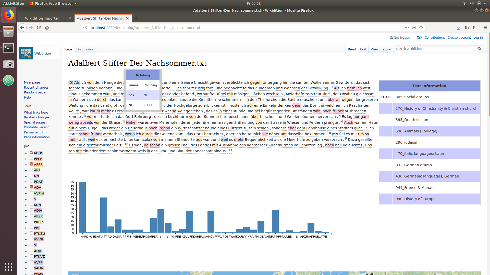
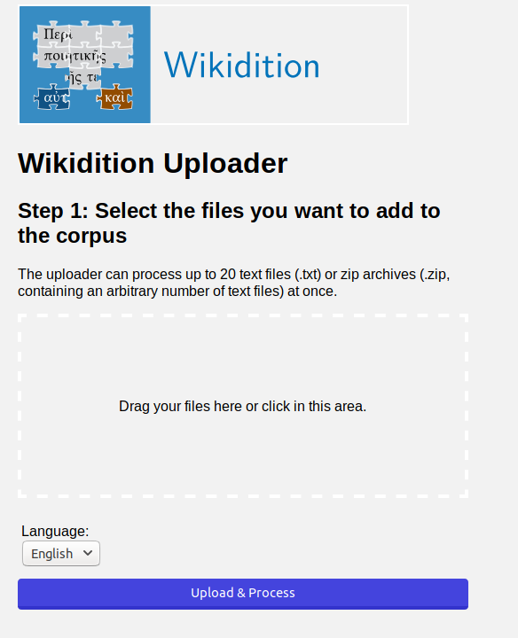

# Corpus2Wiki

Corpus2Wiki is based on MediaWiki and allows the vizualisation of word-, sentence-, paragraph- and text-information. It provides tooltips for all the information, supports graphical hilighting of word-based information, shows a histogram of POS-frequency and a map of the locations mentioned in the text.



The text analysis is made by the TextImager service provided by the Text Technology Lab (University of Frankfurt). Corpus2Wiki currently supports POS, MORPH, DDC, Lemma and NE information in German and English texts.

An import form is provided for simple and automated document analysis and import.

## Installation:

1. Install [docker](https://www.docker.com/get-started) and [docker-compose](https://docs.docker.com/compose/install/)
2. Download this repo
3. Run installation, configuration and start containers by running `./corpus2wiki.sh` from the corpus2wiki directory (or alternatively `docker-compose -f stack.yml up`, if you want a newly compiled Corpus2Wiki container, add --build)

Corpus2Wiki is now set up on port 8080 (default) with the following parameters:

```
- MW_ADMIN_USER=admin
- MW_ADMIN_PASS=password
- MW_DB_NAME=wikidb
- MW_DB_USER=mediawiki
- MW_DB_PASS=wikidbpw
- MW_DB_INSTALLDB_USER=root
- MW_DB_INSTALLDB_PASS=wikiexporterpw
- MW_SCRIPT_PATH=
- MW_SERVER_NAME=http://localhost:8080
```

These parameters can be changed by editing the stack.yml file.

## Start Corpus2Wiki:
Start containers by running:

> <code>./corpus2wiki.sh </code>

or alternatively:  

> <code> docker-compose -f stack.yml up </code>  

from the corpus2wiki directory.

## Building the corpus-wiki-image
For development purposes we can just use build in the directory corpus2wiki.  
Once we are inside the directory we can use:
> <code>sudo docker -t corpus2wikidevSoSe20 .</code>

To create an new image which then can be used by docker-compose.
This allows us to make better use of caching as well as the docker-compose
overhead since we only build the container new and dont wait on the DB to wake up.

Note:changed code shell be copyied at the end of the dockerfile into the new image to maximise the speed up by layers and cache.
Perhaps we may also want to restrukture the dockerfile if development is futher slowed down by building.

## Add Files to Wikitition:



1. Make sure the containers are running, then open your browser and go to localhost:8080/import (if accessing from remote, replace localhost with the appropiate ip-address/url)
2. Select all the files you want to be analized and added to the Corpus2Wiki and select the appropriate settings
3. Pressing the "Upload & Process"-Button will start the import procedure. Please keep the browser open until the process is finished.

## Access Results
Go to localhost:8080 (or ip-address/url if accessing from remote).

Visit "localhost/index.php/Special:AllPages" to see a list of links to your files - click on any of them to access the analyzed text and visualizations.

## Known Bugs
### Timezone skip
We are aware that sometimes when setting up a wiki for the first time, the connection with the MariaDB Container reporst connection
issues and is not setup up properly.After the initial docker compose up it is also only possible to setup the credentials by hand.

This Bug actually stems from the first time the MariaDB and Wiki-Container are initialised.In this process it seaams the
timezone configuration delays the inital setup and if the user is impationed and aborts the setup,everything has to be set by hand.
However the solution to this problem is very easy,just wait.At some point the DB seams to notice the error and fixes it by itself 
depending on the machine 10 - 15 min.But this only works in the inital up, after that the containers are "configured" and load that as 
default.After that the rest of the setup is done without an human intervention as usual.

This Bug atleast exists on win 10 pro 1909,Debian 10 and Ubuntu 18.10.

### Error 127
This error will be displayed if "usr/local/bin/docker-php-entrypoint: 9: exec: /config.sh: not found" happens.
You are mostliky on an windows machine and just have encounterd an encoding problem.

What actually happens,well win and linux uses different symbols to represent an end of line win (CR LF), linux (LF).
So when we download the source cdoe from github and save it on our windows machine it uses the CR LF standart to save the /config.sh - this however produces an damaged file for linux with the LF standart.
Precisesly the first line in which we use shebang to specify the tool to run the config is in shambles and not useable anymore.
Note that for example nano is still able to display the file properly with out problem we litrally cant see the difference.

The solution.
We just revert the config back to LF with an tool of choice: dos2unix,notpad and vscode are jsut a few.
Then we can just build the container normally.

That's it your container should run again. 


## Given Config
A small note on the configuration regarding the internal network of the setup.
The used inter network driver is the bridge driver,however other drivers should also be possible.
Given that we desire to give as many people as possible access to the software we will stick to the bridge driver for compability 
reasons,atleast for now.


## Legal
(c)2018 [Text Technology Lab](https://www.texttechnologylab.org), Goethe University Frankfurt

Authors: Alex Hunziker, Hasanagha Mammadov, Eleanor Rutherford

THE SOFTWARE IS PROVIDED "AS IS", WITHOUT WARRANTY OF ANY KIND, EXPRESS OR IMPLIED, INCLUDING BUT NOT LIMITED TO THE WARRANTIES OF MERCHANTABILITY, FITNESS FOR A PARTICULAR PURPOSE AND NONINFRINGEMENT. IN NO EVENT SHALL THE AUTHORS OR COPYRIGHT HOLDERS BE LIABLE FOR ANY CLAIM, DAMAGES OR OTHER LIABILITY, WHETHER IN AN ACTION OF CONTRACT, TORT OR OTHERWISE, ARISING FROM, OUT OF OR IN CONNECTION WITH THE SOFTWARE OR THE USE OR OTHER DEALINGS IN THE SOFTWARE.
